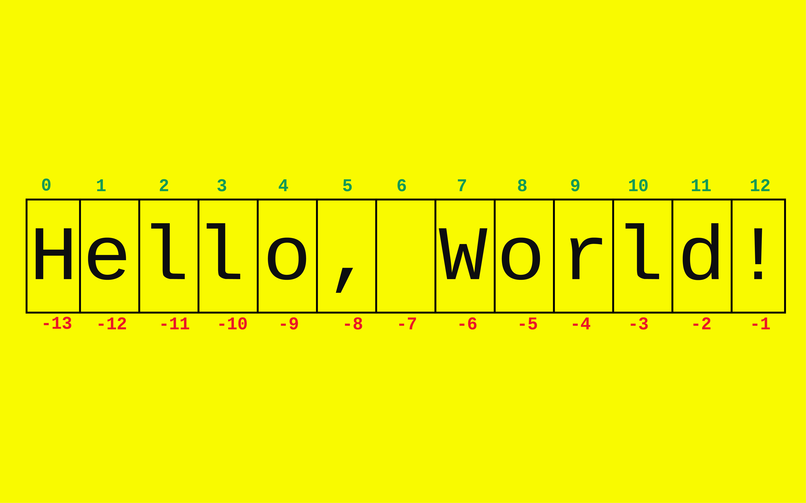

## 9. Работа со строками


Добро пожаловать в тему, посвященную строкам!

Строки - это одна из наиболее важных и широко используемых тип данных в Python(и в программировании в целом).
Они играют ключевую роль в обработке и представлении текстовой информации.

В этой теме мы сосредоточимся на следующих аспектах:

- Создание и конкатенация (объединение строк): познакомимся с основами создания строк и способами их объединения.
- Нарезка (обрезка) строк: вы узнаете, как выделять определенные части строки, а также как обрезать лишние символы.
- Строковые методы: рассмотрим множество встроенных методов для работы со строками, позволяющих выполнить
  различные манипуляции.
- Форматирование строки: вы изучите различные способы форматирования строк для более удобного вывода данных.

Информации будет много, поэтому подкрепитесь хорошенько, заварите кофейку и не забудьте печеньки. Погнали!

---

- [Строки](#строки)
- [Методы строк](#методы-строк)
- [Форматирование(интерполяция)](#форматирование-интерполяция)
- [Задания по теме](#задания)

---

### Строки

Строки представляют собой объекты, состоящие из упорядоченной последовательности символов, это может быть
символы из различных алфавитов, цифры, специальные символы и знаки пунктуации.
`Python 3` использует `Unicode` для представления символов, что позволяет работать с символами из различных языков(
_японский, китайский, арабский_ и т.д.).

> Про `Unicode` более подробно:
> - [На русском](https://tproger.ru/translations/unicode-and-encoding-python-guide/?ysclid=lkzx3mjz8j838473895)
> - [На английском](https://realpython.com/python-encodings-guide/)
> - Также [таблица](https://snipp.ru/handbk/table-ascii) символов `ASCII` + `Windows 1251`

**Литералы строки:**

Примеры литералов строк:

```python
string_1 = 'Python is fun!'
string_2 = "Python - замечательный язык программирования!"
string_3 = '900100'  # это строка
```

Для создания строки можно использовать как одинарные, так и двойные кавычки. Это позволяет включать кавычки внутри
строк, используя различные виды кавычек для определения строки.

Пример:

```python
question_1 = 'What"s your name?'
question_2 = "What's your name?"
```

Иначе вам пришлось бы использовать экранирование кавычек с помощью  <code>&#92;</code> (обратного слэша).

```python
question_3 = "What\"s your name?"
question_4 = 'What\'s your name?'
```

**Длина строки:**

Под длиной строки подразумевается количество символов в ней, включая видимые и невидимые символы, такие как
пробелы, табуляции, переносы строк и т.д. Для получения длины строки используется встроенная функция `len()`.

Примеры:

```python
string_1 = 'Python is fun!'
print(len(string_1))  # 14

string_2 = "Python - замечательный язык программирования!"
print(len(string_2))  # 45

print(len('\n'))  # 1 (перенос строки)
print(len('\t'))  # 1 (табуляция)
print(len(' '))  # 1 (пробел)
print(len('\r'))  # 1 (возврат каретки)
```

**Максимальная длина строки:**

Максимальная длина строки зависит от платформы, на которой выполняется код. Обычно это:

- На 32-битной платформе максимальная длина строки составляет <code>2<sup>31</sup> - 1</code> символов. Это равно
  примерно 2 миллиардам символов.
- На 64-битной платформе максимальная длина строки составляет <code>2<sup>63</sup> - 1</code> символов. Это огромное
  число, значительно превышающее 2 миллиарда символов.

> Это означает, что вы можете создать строки длиной, не превышающей указанных значений. Однако, стоит заметить, что
> попытка создать строку превышающую максимальную длину, приведет к ошибке или неожиданному поведению программы.


**Доступ к символам строки (Индексация):**

В Python строки индексируются, что позволяет обращаться к отдельным символам в строке. Индексация начинается
с `0`, то есть первый символ имеет индекс `0`, второй - индекс `1` и так далее. Также можно использовать
отрицательную индексацию, где `-1` соответствует последнему символу, `-2` - предпоследнему и так далее.



```python
# По положительному индексу
text = "Hello, World!"
first_char = text[0]  # "H"
last_char = text[12]  # "!"

# По отрицательному индексу
first_char_2 = text[-13]  # "H"
last_char_2 = text[-1]  # "!"
```

**Срезы строк (Slicing):**

Помимо индексации, можно получить подстроки[^3] из целевой (исходной) строки[^5] с помощью срезов.
Проще говоря, срезы позволяют выбирать из строки определенный диапазон символов.

Формат среза выглядит следующим образом:

```
line[start:stop:step]
```

где:

- `start` - индекс символа, с которого начинается срез (включительно).
    - `line[start::step]` - от `start` до конца с шагом `step`
    - `line[start::]` - от `start` до конца с шагом `1`

- `stop` - индекс символа, до которого продолжается срез (не включается).
    - `line[:stop:step]` - от начала до `stop` с шагом `step`
    - `line[:stop:]` - от начала до `stop` с шагом `1`

- `step` (необязательно) - шаг, с которым выбираются символы (по умолчанию равен 1).
    - `line[start:stop:]` - от `start` до `stop` с шагом `1`
    - `line[start:stop:step]` - от `start` до `stop` с шагом `step`
    - `line[::step]`  - от начала до конца строки с шагом `step`
    - `line[::]` - от начало до конца с шагом `1` (другими словами, выводятся все символы строки)

```python
text = "Hello, World!"

# Получим подстроку с индекса 0 до 5 (не включительно)
positive_slice_1 = text[0:5]  # "Hello"

# Получим подстроку с индекса 7 до конца строки
positive_slice_2 = text[7:]  # "World!"

# Получим подстроку с индекса 2 до 9 с шагом 2
positive_slice_3 = text[2:9:2]  # "lo o"

# Получим каждый второй символ из всей строки
positive_slice_4 = text[::2]  # "Hlo ol!"
```

Рассмотрим несколько примеров с отрицательными индексами:

```python
text = "Hello, World!"

# Получим строку в обратном порядке
by_negative_slice_1 = text[::-1]  # "!dlroW ,olleH"

# Получим строку, начиная с последнего символа и двигаясь 
# в обратном направлении до индекса -6 (не включая его)
by_negative_slice_2 = text[-1:-6:-1]  # "!dlro"

# Получим каждый второй символ, начиная 
# с последнего и двигаясь в обратном направлении
by_negative_slice_3 = text[::-2]  # "!lo olH"

# Получим подстроку, начиная с последнего символа и двигаясь 
# в обратном направлении до индекса -13 (не включительно)
by_negative_slice_4 = text[-1:-13:-1]  # "!dlroW ,olle"
```

**Обращение к несуществующему индексу строки:**

При обращении к элементам строки по индексу, индексы должны находиться в допустимом диапазоне, т.е. от `0`
до `длины строки минус 1`. Если индекс находится за пределами этого диапазона, то будет возникать ошибка `IndexError`.

```python
text = "Hello, World!"

# В данном случае, индекс 15 выходит за пределы длины строки
print(text[15])  # IndexError: string index out of range
```

Python сообщает, что индекс выходит за пределы допустимого диапазона строки, что указывает на несуществующий элемент.
Поэтому всегда стоит быть внимательным при обращении к элементам строки по индексу, чтобы избежать подобных ошибок.

При использовании срезов(slicing), указание конечного индекса, превышающего длину строки, не вызывает ошибку. Вместо
этого, срез будет произведен до конца строки без возникновения исключения.

```python
text = "Hello, World!"

# Указываем конечный индекс 20, хотя длина строки всего 13 символов
sliced_text = text[7:20]

print(sliced_text)  # "World!"
```

Здесь использовали срез `text[7:20]` хотя длина строки всего 13 символов, Python не вызывает ошибку и обрезает строку до
конца, в результате получаем `"World!"`. Это одно из удобств срезов, которое позволяет легко обрабатывать строки без
необходимости проверки на предельные значения индексов. Однако, при обращении к отдельному элементу по индексу за
пределами длины строки, возникнет ошибка `IndexError`, как мы видели в предыдущем примере.

**Изменение или удаление строки:**

Строка - **неизменяемый** тип данных это означает, что после создания строки мы не можем изменить её элементы. Однако,
можем легко переназначить переменную на другую строку.

```python
greeting = "Bonjour!"

# Это вызовет ошибку TypeError: 'str' object does not support item assignment
greeting[6] = "t"

# Можем переназначить переменную на другую строку
greeting = "Bonjour tout le monde!"  
```

Мы не можем изменить шестой элемент строки `"Bonjour!"`, но можем переназначить переменную `greeting` на
новую строку `"Bonjour tout le monde!"` без проблем.

**Конкатенация строк:**

Конкатенация[^1] строк представляет собой операцию объединения двух или более строк в одну. Это делается путем
использования оператора `+`. При конкатенации строки просто склеиваются в порядке их указания.

```python
first_name = "John"
last_name = "Doe"

full_name = first_name + " " + last_name
print(full_name)  # "John Doe"

other = "Hello" "World"
print(other)  # "HelloWorld"
```

**Умножение строки на число:**

Умножение строки на число позволяет повторить строку заданное количество раз, для этого используется оператор `*`.

```python
text = "hello"
repeated_text = text * 3
print(repeated_text)  # "hellohellohello"

text_2 = "world"
repeated_text_2 = text_2 * 0
print(repeated_text_2)  # ""
```

**Сравнение строк между собой:**

`==`, `!=`, `<`, `>`, `<=`, `>=`

Строки сравниваются символ за символом на основе их кодовых точек в таблице
символов [Unicode](https://home.unicode.org/).

> Полезно знать: [Несколько советов программистам](https://habr.com/ru/articles/544084/).

```python
line_1 = "apple"
line_2 = "banana"

print(line_1 == line_2)  # False
print(line_1 != line_2)  # True
print(line_1 < line_2)  # True
print(line_1 > line_2)  # False

fruit_1 = 'kiwi'
fruit_2 = 'kiwi'

print(fruit_1 <= fruit_2)  # True
print(fruit_1 >= fruit_2)  # True
```

**Проверка на вхождение:**

Проверка на вхождение подстроки[^2] в целевую строку выполняется с помощью операторов `in` или `not in`.
Оператор `in` возвращает `True`, если подстрока содержится в строке и `False` в противном случае.

```python
text = "Hello, World!"

print("Hello" in text)  # True
print("hello" in text)  # False
print("orl" in text)  # True
print(", " in text)  # True

print("world" not in text)  # True
print("World" not in text)  # False
print("lo, W" not in text)  # False
```

**Итерирование по строке:**

Итерирование[^3] по строке можно выполнять как с помощью цикла `for`, так и с помощью цикла `while`.
В обоих случаях будем перебирать каждый символ строки по порядку.

Итерирование с помощью цикла `for`:

```python
text = "Hello, World!"

for char in text:
    print(char)
```

_Вывод_

```
H
e
l
l
o
,
 
W
o
r
l
d
!
```

Итерирование с помощью цикла `while`:

```python
text = "Hello, World!"

i = 0
while i < len(text):
    print(text[i])
    i += 1
```

При использовании цикла `while` для итерирования по строке, создаем счетчик `i`, который будет индексом символа в
строке. Затем проверяем, что значение счетчика `i` меньше длины строки `len(text)`. Если это условие выполняется,
выводим символ строки по индексу `i` с помощью `text[i]` и увеличиваем счетчик `i` на `1` (инкрементируем)
с каждой итерацией, чтобы перейти к следующему символу. Этот процесс продолжается до тех пор, пока счетчик не
достигнет длины строки, и тем самым переберет все символы строки.

_Вывод_

```
H
e
l
l
o
,
 
W
o
r
l
d
!
```

В обоих примерах прошлись по каждому символу строки `"Hello, World!"` и вывели их по отдельности. В первом примере
использовался цикл `for`, который автоматически проходит по каждому элементу строки, а во втором примере - цикл `while`,
где мы явно управляем индексом для итерации по строке.

---

**Функции `chr()` и `ord()`:**

* Функция `chr`
    * Используется для преобразования целого числа (код символа Unicode) в соответствующий символ.

 ```python
char_code = 65
char = chr(char_code)
print(char)  # 'A'
```

```python
char_codes = [72, 101, 108, 108, 111]  # Коды символов

message = ''  # Выходная строка
for code in char_codes:
    char = chr(code)  # Преобразование кода символа в символ
    message += char  # Конкатенация

print(message)  # 'Hello'
```

* Функция `ord`
    * Выполняет обратное преобразование, она принимает символ в качестве аргумента и возвращает его код символа Unicode.

```python
char = 'A'
char_code = ord(char)
print(char_code)  # 65
```

```python
message = "Hello"  # Исходная строка

char_codes = []  # Коды символов
for char in message:
    code = ord(char)  # Преобразование символа в код Unicode
    char_codes.append(code)  # Добавляется в список

print(char_codes)  # [72, 101, 108, 108, 111]
```

---

**R-строки (raw strings - сырые (необработанные) строки):**   

В r-строках символы экранирования `\n`, `\t`, <code>&bsol;</code> и другие, не обрабатываются.
Все символы экранирования рассматривается как обычный символ и печатается как есть. 
R-строки обозначаются с помощью префикса `r` (или `R`) перед открывающей кавычкой, например, `r"Это r-строка"`

Их нужно использовать в тех случаях, когда вам нужно работать с текстом, который может содержать 
символы экранирования, и вы хотите избежать их автоматической интерпретации.

Рассмотрим несколько примеров использования r-строк:

* Символы экранирования в пути к файлу:

```python
path = r"C:\Users\new_user\Documents"

print(path)  # C:\Users\new_user\Documents
```

```python
path_2 = "C:\Users\new_user\Documents"
# SyntaxError: (unicode error) 'unicodeescape' codec can't decode bytes in position 2-3: truncated \UXXXXXXXX escape

print((path_2))  # Конфликт
```

* Использование символа обратной косой черты как обычного символа:

```python
text = r"Это строка с обратной косой чертой \\"

print(text)  # Это строка с обратной косой чертой \\
```

* Сохранение форматирования в строках

```python
docstring = r"""
Это строка документации.
Она может содержать \n переводы строк
и другие символы экранирования, но они не будут интерпретироваться.
"""

print(docstring)
# Это строка документации.
# Она может содержать \n переводы строк
# и другие символы экранирования, но они не будут интерпретироваться.
```

```python
docstring_2 = """
Это строка документации.
Она может содержать \n переводы строк
и другие символы экранирования, они будут интерпретироваться.
"""

print(docstring_2)

# Это строка документации.
# Она может содержать 
#  переводы строк
# и другие символы экранирования, они будут интерпретироваться.
```

---

### Методы строк

Методы[^4] позволяют изменять визуальное представление строки, производить замены подстрок,
находить позиции символов, выполнять проверки на начало или конец строки и др.

**Синтаксис вызова метода:**

Методы строк можно вызывать на конкретных строковых объектах. Есть два основных варианта синтаксиса:

1. Без аргументов
    - `объект_строки.название_метода()`
    - `'hello'.upper()` вернет `'HELLO'`
2. С аргументами:
    - `объект_строки.название_метода(аргумент_1, аргумент_2)`
    - `'foo goo moo'.replace('oo', 'abc')` вернет `'fabc gabc mabc'`

---

<details>
<summary><b>Изменение регистра строки</b></summary>

В этой группе методов рассмотрим методы, которые влияют на регистр символов в строке.

> ВАЖНО!
>
> Напоминаю, что строки в Python являются неизменяемыми объектами, поэтому методы влияющие на регистр символов,
> всегда создают и возвращают новый объект строки.
> ```python
> line = 'Hello'
> print(id(line))  # 1813462656048
> 
> line = line.upper()  # 'HELLO'
> print(id(line))  # 1813462656112
> 
> # Как видите, у этих объектов разные идентификаторы
> ```

---

`str.capitalize()` - преобразует первую букву строки в верхний регистр, а все остальные символы - в нижний.

```python
picasso = 'everyTHing yoU Can IMaGine is rEAl'
print(picasso.capitalize())  # 'Everything you can imagine is real'

# Неалфавитные символы не изменяются
mail = 'MY MaiL PY123@python.ORG'
print(mail.capitalize())  # 'My mail py123@python.org'
```

Метод `picasso.capitalize()` вернет копию строки `picasso` с первым символом, преобразованным в верхний регистр,
и все остальные символы в нижний регистр.

---

`str.lower()` - преобразует все буквенные символы строки в нижний регистр.

```python
picasso = 'everyTHing yoU Can IMaGine is rEAl'
print(picasso.lower())  # 'everything you can imagine is real'

# Неалфавитные символы не изменяются
mail = 'MY MaiL PY123@python.ORG'
print(mail.lower())  # 'my mail py123@python.org'
```

Метод `picasso.lower()` вернет копию строки `picasso`, где все буквенные символы преобразованы в нижний регистр.

---

`str.swapcase()` - меняет регистр буквенных символов на противоположный.

```python
picasso = 'everyTHing yoU Can IMaGine is rEAl'
print(picasso.swapcase())  # 'EVERYthING YOu cAN imAgINE IS ReAL'
```

Метод `picasso.swapcase()` вернет копию строки `picasso`, где заглавные буквенные символы преобразованы
в строчные, а строчные - в заглавные.

---

`str.title()` - преобразует первые буквы всех слов в строке в заглавные.

```python
picasso = 'everyTHing yoU Can IMaGine is rEAl'
print(picasso.title())  # 'Everything You Can Imagine Is Real'

picasso = 'everyTHing !yoU Can IMaGine "is rEAl'
print(picasso.title())  # 'Everything !You Can Imagine "Is Real'

other = 'McDonald"s'
print(other.title())  # Mcdonald"S
```

Метод `picasso.title()` вернет копию строки `picasso`, в которой первая буква каждого слова преобразуется
в верхний регистр, а все остальные буквы - в нижний регистр.

Этот метод не различает важные и неважные слова, и не обрабатывает апострофы, имена или аббревиатуры.

---

`str.upper()` - преобразует все буквенные символы в строке в верхний регистр.

```python
picasso = 'everyTHing yoU Can IMaGine is rEAl'
print(picasso.upper())  # 'EVERYTHING YOU CAN IMAGINE IS REAL'
```

Метод `picasso.upper()` вернет копию строки `picasso` с каждым буквенным символом преобразованным в верхний регистр.


</details>

---

<details>
<summary><b>Поиск и замена подстроки в строке</b></summary>

Методы этой группы предоставляют различные способы поиска указанной подстроки[^1] в целевой строке[^5].

Каждый метод из этой группы также поддерживает необязательные аргументы `<start>` и `<end>`, определяющие
диапазон поиска. Действие метода ограничивается частью целевой строки, начиная с символа в позиции `<start>` и
заканчивая символом в позиции `<end>`, но не включая его. Если `<start>` указан, а `<end>` не указан,
метод применяется к части строки от `<start>` до конца.

---

`str.count(<sub>[, <start>[, <end>]])` - подсчитывает количество вхождений подстроки в строку.

```python
line = 'foo goo moo'

print(line.count('oo'))  # 3

# Указание диапазона изменяет количество вхождений
print(line.count('oo', 0, 8))  # 2
```

Метод `line.count(<sub>)` возвращает количество точных вхождений подстроки `<sub>` в строку `line`.

---

`str.endswith(<suffix>[, <start>[, <end>]])` - проверяет, заканчивается ли строка заданной подстрокой.

```python
line = 'python'

print(line.endswith('on'))  # True
print(line.endswith('ava'))  # False
print(line.endswith('python'))  # True
```

Можно также передать несколько возможных окончаний в виде кортежа. Метод возвращает `True`, если хотя бы одно
из окончаний подходит, в противном случае `False`.

```python
line = 'python'

print(line.endswith(('hon', 'ava', 'n')))  # True
print(line.endswith(('lua', 'uby', 'tu')))  # False
```

---

`str.find(<sub>[, <start>[, <end>]])` - ищет указанную подстроку в строке.

```python
line = 'Follow Us @Python'
print(line.find('Us'))  # 7
```

Метод `line.find(<sub>)` возвращает индекс первого вхождения подстроки `<sub>` в строку `line`.

Если указанная подстрока не найдена, метод возвращает `-1`.

```python
line = 'Follow Us @Python'
print(line.find('Java'))  # -1
```

Поиск в строке ограничивается подстрокой между символами `<start>` и `<end>`, если они указаны.

```python
line = 'Follow Us @Python'
print(line.find('Us', 4))  # 7
print(line.find('Us', 4, 7))  # -1
```

---

`str.index(<sub>[, <start>[, <end>]])` - также как `str.find()` ищет указанную подстроку в строке,
но вызывает исключение `ValueError`, если подстрока не найдена.

```python
line = 'Follow Us @Python'
print(line.index('Java'))  # ValueError: substring not found
```

---

`str.rfind(<sub>[, <start>[, <end>]])` ищет подстроку, начиная с конца строки.

```python
line = 'Follow Us @Python'
print(line.rfind('o'))  # 15
```

Метод `line.rfind(<sub>)` возвращает индекс последнего вхождения подстроки `<sub>` в строке `line`.

Если подстрока не найдена, метод возвращает `-1`.

```python
line = 'Follow Us @Python'
print(line.rfind('a'))  # -1
```

Поиск в строке ограничивается подстрокой между символами `<start>` и `<end>`, если они указаны.

---

`str.rindex(<sub>[, <start>[, <end>]])` - идентичен `str.rfind()`, но вызывает исключение `ValueError`,
если подстрока не найдена.

```python
line = 'Follow Us @Python'
print(line.rindex('Lua'))  # ValueError: substring not found
```

---

`str.startswith(<prefix>[, <start>[, <end>]])` - проверяет, начинается ли строка с указанной подстроки.

```python
line = 'python'

print(line.startswith('on'))  # False
print(line.startswith('ava'))  # False
print(line.startswith('python'))  # True
```

Метод `line.startswith(<prefix>)` возвращает `True`, если строка начинается с указанной подстроки,
и `False` в противном случае.

Также можно передать несколько возможных начал в виде кортежа. Метод возвращает `True`, если хотя бы одно
из начал подходит, в противном случае `False`.

```python
line = 'python'

print(line.startswith(('pyth', 'p', 'lua')))  # True
print(line.startswith(('jav', 'uby', 'go')))  # False
```

Сравнение ограничено подстрокой, между `<start>` и `<end>`, если они указаны

```python
line = 'python'

print(line.startswith('py', 0, 3))  # True
print(line.startswith('yt', 1, 5))  # True
print(line.startswith('yt', 2, 4))  # False
```

</details>

---

<details>
<summary><b>Классификация строк</b></summary>

В этой группе методов происходит классификация строк на основе символов, которые они содержат.

---

`str.isalnum()` проверяет, состоит ли строка только из букв и цифр.

```python
text = 'Python123'
print(text.isalnum())  # True

text = 'Python'
print(text.isalnum())  # True

text = '123'
print(text.isalnum())  # True

text = 'Python 123'
print(text.isalnum())  # False

text = 'Python2.7'
print(text.isalnum())  # False

text = ''
print(text.isalnum())  # False
```

Метод `text.isalnum()` возвращает `True`, если строка `text` не пуста и все её символы являются
буквенно-цифровыми (либо буква, либо цифра), в противном случае `False`.

---

`str.isalpha()` - проверяет, состоит ли строка только из букв.

```python
word = 'Python'
print(word.isalpha())  # True

word = 'Python3'
print(word.isalpha())  # False

word = '#TagPython'
print(word.isalpha())  # False

word = ''
print(word.isalpha())  # False
```

Метод `word.isalpha()` возвращает `True`, если строка `word` не пуста и все её символы являются буквенными,
в противном случае `False`.

---

`str.isdecimal()` - проверяет, состоит ли строка только из десятичных цифр.

```python
number = '12345'
print(number.isdecimal())  # True

number = 'Hello'
print(number.isdecimal())  # False

number = '12.34'
print(number.isdecimal())  # False

number = 'Cyberpunk 2077'
print(number.isdecimal())  # False

number = ''
print(number.isdecimal())  # False
```

Метод `number.isdecimal()` проверяет, состоит ли `number` только из десятичных цифр.
Десятичные цифры включают только символы от `0` до `9`.

---

`str.isdigit()` - проверяет, состоит ли строка только из цифр (проверка на число).

```python
number = '12345'
print(number.isdigit())  # True

number = 'Hello'
print(number.isdigit())  # False

number = '12.34'
print(number.isdigit())  # False

number = 'Cyberpunk 2077'
print(number.isdigit())  # False

number = ''
print(number.isdigit())  # False
```

Метод `number.isdigit()` возвращает `True`, если строка `number` не пуста и все её символы являются цифрами,
в противном случае `False`.

---

`str.isnumeric()` - проверяет, состоит ли строка только из символов, которые являются числовыми символами
в различных письменностях и кодировках.

```python
number = '12345'
print(number.isnumeric())  # True

number = '½'  # одна вторая
print(number.isnumeric())  # True

number = 'Ⅻ'  # римская цифра 12
print(number.isnumeric())  # True

number = 'Hello'
print(number.isnumeric())  # False

number = ''
print(number.isnumeric())  # False
```

Метод `number.isnumeric()` проверяет, состоит ли строка не только из десятичных цифр, но и дробные числа,
римские цифры и числа на других языках.

> Подытожим три метода, `.isdecimal()`, `.isdigit()` и `.isnumeric()`
> ```python
> # Является ли 42 десятичным(isdecimal), цифровым(isdigit) или числовым(isnumeric)?
> print('42'.isdecimal())  # True
> print('42'.isdigit())    # True
> print('42'.isnumeric())  # True
> ```
>
> ---
>
> ```python
> # Является ли ² (верхний индекс два) десятичным(isdecimal), цифрой(isdigit) или числом(isnumeric)?
> print('\u00b2'.isdecimal())  # False
> print('\u00b2'.isdigit())    # True
> print('\u00b2'.isnumeric())  # True
> 
> # \u00b2 - это верхний индекс два в Unicode
> # https://www.compart.com/en/unicode/U+00B2
>```
>
> ---
>
> ```python
> # Является ли ⅓ (простая дробь одна треть) десятичным(isdecimal), цифровым(isdigit) или числовым(isnumeric)?
> print('\u2153'.isdecimal())  # False
> print('\u2153'.isdigit())    # False
> print('\u2153'.isnumeric())  # True
> 
> # \u2153 - это простая дробь одна треть в Unicode
> # https://www.compart.com/en/unicode/U+2153
>```

---

`str.isidentifier()` - проверяет, является ли строка допустимым идентификатором Python.

```python
my_identifier = 'variable_name'
print(my_identifier.isidentifier())  # True

my_identifier = '123variable'
print(my_identifier.isidentifier())  # False

# Будьте осторожны, метод допускает ошибки
my_identifier = 'if'
print(my_identifier.isidentifier())  # True

my_identifier = ''
print(my_identifier.isidentifier())  # False
```

Метод `my_identifier.isidentifier()` возвращает `True`, если строка `my_identifier` является допустимым идентификатором
Python (название переменной, функции, класса и т.д.), в противном случае `False`.

---

`str.islower()` - проверяет, являются ли все буквенные символы строки строчными.

```python
text = 'hello world'
print(text.islower())  # True

text = 'Hello World'
print(text.islower())  # False

text = 'python2.7'
print(text.islower())  # True

text = ''
print(text.islower())  # False
```

Метод `text.islower()` возвращает `True`, если строка `text` не пуста и все её буквенные символы строчные,
в противном случае `False`.

---

`str.isprintable()` - проверяет, состоит ли строка только из печатаемых символов.

```python
message = 'Hello, World!'
print(message.isprintable())  # True

message = 'Hello\nWorld!'
print(message.isprintable())  # False

message = 'Hello\r\tWorld!'
print(message.isprintable())  # False

message = ''
print(message.isprintable())  # True
```

Метод `message.isprintable()` возвращает `True`, если строка `message` пуста или все её символы могут быть
выведены на экран, в противном случае, `False`.

> ВАЖНО:
>
> Это единственный `.is****()` метод, который возвращает `True`, если строка пуста. Все остальные возвращают `False`.

---

`str.isspace()` - проверяет, состоит ли строка только из пробельных символов.

```python
spaces = '    '
print(spaces.isspace())  # True

spaces = '\t  \f  \r  \u2005'
print(spaces.isspace())  # True

text = ' Hello, World! '
print(text.isspace())  # False

text = ''
print(text.isspace())  # False
```

Метод `spaces.isspace()` возвращает `True`, если строка `spaces` не пуста и все её символы являются пробельными,
противном случае `False`.

---

`str.istitle()` - проверяет, начинаются ли слова в строке с заглавной буквы.

```python
title = 'Python Is Fun'
print(title.istitle())  # True

title = 'Python is Fun'
print(title.istitle())  # False

title = 'The Use Of 1234 To Say "Python Is Fun"'
print(title.istitle())  # True

title = ''
print(title.istitle())  # False
```

Метод `title.istitle()` возвращает `True`, если строка `title` не пуста и первый алфавитный символ каждого
слова в верхнем регистре, а все остальные буквенные символы в каждом слове строчные.
В противном случае, возвращает `False`.

---

`str.isupper()` - проверяет, являются ли все буквенные символы строки заглавными.

```python
text = 'ALL CAPS'
print(text.isupper())  # True

text = 'Some Capitalized Words'
print(text.isupper())  # False

text = 'CYBERPUNK 2077'
print(text.isupper())  # True

text = ''
print(text.isupper())  # False
```

Метод `text.isupper()` возвращает `True`, если строка `text` не пуста и все её буквенные символы являются заглавными,
в противном случае, возвращает `False`.

</details>

---

<details>
<summary><b>Выравнивание строк</b></summary>

В этой группе методов рассмотрим способы выравнивания строки с использованием различных заполнителей.

---

`str.center(<width>[, <fill>])` - выравнивает строку по центру.

```python
message = 'Hello'
print(message.center(10))  # '  Hello   '

message = 'World'
print(message.center(12, '*'))  # '***World****'

message = 'Python'
print(message.center(6, '*'))  # 'Python'

message = ''
print(message.center(9, '*'))  # '*********'
```

Метод `message.center(<width>)` возвращает строку, в которой строка `message` выровнена по центру поля шириной
`<width>`. По умолчанию, заполнитель состоит из пробелов `ASCII`. Если указан необязательный параметр `<fill>`, он
используется как символ заполнения. Если длина `message` больше или равна `<width>`, строка возвращается без изменений.

---

`str.expandtabs(tabsize=8)` - заменяет символы табуляции `\t` на пробелы.

```python
text = 'Hello\tWorld'
# если параметр tabsize не передается, 
# размер табуляции по умолчанию равен 8 пробелов
print(text.expandtabs())  # 'Hello   World'

text = 'Hel\tlo World'
print(text.expandtabs(tabsize=12))  # 'Hel         lo World'

text = 'Hello W\torl\td'
print(text.expandtabs(tabsize=9))  # 'Hello W  orl      d'

text = '\t'
print(text.expandtabs(tabsize=5))  # '     ' из 5 пробелов

text = ''
print(text.expandtabs(tabsize=7))  # ''
```

Метод `text.expandtabs()` заменяет каждый символ табуляции `\t` пробелами.
По умолчанию, табуляция заменяется на 8 пробелов. Необязательный параметр `tabsize` задает количество пробелов

> Более подробно об этом методе [здесь](https://www.programiz.com/python-programming/methods/string/expandtabs)

---

`str.ljust(<width>[, <fill>])` - выравнивает строку по левому краю.

```python
word = 'Python'
print(word.ljust(10))  # 'Python    '

word = 'Python'
print(word.ljust(10, '-'))  # 'Python----'

word = 'Java'
print(word.ljust(4, '@'))  # 'Java'

word = 'Go'
print(word.ljust(4, '@'))  # 'Go@@'

word = ''
print(word.ljust(5, '?'))  # '?????'
```

Метод `word.ljust(<width>)` возвращает строку `word`, выровненную по левому краю в поле шириной `<width>`.
По умолчанию, заполнитель состоит из пробелов `ASCII`. Если указан параметр `<fill>`, он используется как
символ заполнения. Если длина `word` больше или равна `<width>`, строка возвращается без изменений.

---

`str.lstrip([<chars>])` - удаляет переданный(ые) символ(ы) с левой стороны.

```python
text = '   \n\n\t\tHello\t'
# если не передать символ для удаления, по умолчанию удаляются пробельные символы
print(text.lstrip())  # 'Hello	'

text = '---World--'
print(text.lstrip('-'))  # 'World--'

text = '-#---%-@-Python@#'
print(text.lstrip('-%#@'))  # 'Python@#'

text = ''
print(text.lstrip('-%#@'))  # ''

text = ''
print(text.lstrip(''))  # ''
```

Метод `text.lstrip()` возвращает копию `text`, из которой удалены все пробельные символы с левой стороны.
Необязательный параметр `<chars>` определяет набор символов, которые будут удалены.

---

`str.replace(<old>, <new>[, <count>])` - заменяет подстроки в строке.

```python
sentence = 'foo goo moo'
sentence = sentence.replace('oo', 'lala')
print(sentence)  # 'flala glala mlala'

sentence_2 = 'Hello, World!'
sentence_2 = sentence_2.replace('l', 'p', 2)
print(sentence_2)  # 'Heppo, World!'

sentence_3 = 'boo roo yoo'
sentence_3 = sentence_3.replace(' ', '', 1)
print(sentence_3)  # 'booroo yoo'

sentence_4 = 'lala'
sentence_4 = sentence_4.replace('', '$')
print(sentence_4)  # '$l$a$l$a$'

sentence_5 = ''
sentence_5 = sentence_5.replace('', 'wow')
print(sentence_5)  # 'wow'
```

Метод `sentence.replace(<old>, <new>)` возвращает копию строки `sentence`, в которой все вхождения подстроки
`<old>` заменены на подстроку `<new>`.
Если указан необязательный параметр `<count>`, будет выполнено не более <count> замен.

---

`str.rjust(<width>[, <fill>])` - выравнивает строку по правому краю.

```python
word = 'Python'
print(word.rjust(10))  # '    Python'

word = 'Python'
print(word.rjust(10, '-'))  # '----Python'

word = 'Java'
print(word.rjust(4, '@'))  # 'Java'

word = 'Go'
print(word.rjust(4, '@'))  # '@@Go'

word = ''
print(word.rjust(7, '~'))  # '~~~~~~~'
```

Метод `word.rjust(<width>)` возвращает строку `word`, выровненную по правому краю в поле шириной `<width>`.
По умолчанию, заполнитель состоит из пробелов `ASCII`. Если указан параметр `<fill>`, он используется
как символ заполнения. Если длина `word` больше или равна `<width>`, строка возвращается без изменений.

---

`str.rstrip([<chars>])` - удаляет переданный(ые) символ(ы) с правой стороны.

```python
text = '\t Hello\n\n\t\t   '
# если не передать символ для удаления, по умолчанию удаляются пробельные символы
print(text.rstrip())  # '	 Hello'

text = '--World---'
print(text.rstrip('-'))  # '--World'

text = 'Python-#---%-@-'
print(text.rstrip('-%#@'))  # '@-#Python'

text = ''
print(text.rstrip('-%#@'))  # ''

text = ''
print(text.rstrip(''))  # ''
```

Метод `text.rstrip()` возвращает копию `text`, из которой удалены все пробельные символы с правой стороны.
Необязательный параметр `<chars>` определяет набор символов, которые будут удалены.

---

`str.strip([<chars>])` - удаляет переданный(ые) символ(ы) с обеих сторон строки.

```python
text = ' \t\t\n  Hello  \t\t\n '
print(text.strip())  # 'Hello'

text = '---Hello---'
print(text.strip('-'))  # 'Hello'

text = '-#---%-@-Python-#---%-@-'
print(text.strip('-%#@'))  # 'Python'

text = ''
print(text.strip('-%#@'))  # ''

text = ''
print(text.strip(''))  # ''
```

Метод `text.strip()` эквивалентен последовательному вызову `text.lstrip()` и `text.rstrip()`.
Если не указан параметр `<chars>`, метод удаляет пробелы в начале и в конце строки.

> ВАЖНО:
>
> Когда возвращаемое значение метода является другой строкой, методы можно вызывать последовательно.
> Мы можем сначала использовать метод `.lstrip('+')` для удаления плюсов слева, а затем метод `.rstrip('-')`
> для удаления дефисов справа. Или можем вызвать `.strip('+-')`, который удаляет плюсы и дефисы с обеих сторон.
> ```python
> text = '+++Hello, World!---'
> print(text.lstrip('+').rstrip('-'))  # 'Hello, World!'
> 
> print(text.strip('+-'))  # 'Hello, World!'
> ```

---

`str.zfill(<width>)` - дополняет строку нулями слева.

```python
number = '42'
print(number.zfill(5))  # '00042'

number = '-42'
print(number.zfill(5))  # '-0042'

number = '777111'
print(number.zfill(6))  # '777111'

word = 'abc'
print(word.zfill(7))  # '0000abc'

word = ''
print(word.zfill(3))  # '000'
```

Метод `number.zfill(<width>)` возвращает строку `number`, дополненную нулями слева для достижения
указанной длины `<width>`. Если `number` содержит знак перед цифрами, он остается слева от строки.
Если длина `number` больше или равна `<width>`, строка возвращается без изменений.

Метод `str.zfill()` наиболее полезен для строковых представлений чисел, но Python также позволяет
дополнять строки нулями, даже если в них нет чисел.

</details>

---

<details>
<summary><b>Методы преобразования строки в список</b></summary>

В этой группе методов рассмотрим способы преобразования строки в список и наоборот.
Эти методы обычно принимают и возращают итерируемые объекты[^6].

---

`str.join(<iterable>)` - объединяет последовательность (строка, список, кортеж, множество и т.д.) в строку.

```python
words = ['foo', 'bar', 'baz', 'qux']
result = '@_@ '.join(words)
print(result)  # 'foo@_@ bar@_@ baz@_@ qux'

words = []
result = '$'.join(words)
print(result)  # ''
```

```python
fruit_list = ['apple', 'banana', 'kiwi', 'orange']
fruit_tuple = ('apple', 'banana', 'kiwi', 'orange')
fruit_set = {'apple', 'banana', 'kiwi', 'orange'}

print('&'.join(fruit_list))  # 'apple&banana&kiwi&orange'

print('\t'.join(fruit_tuple))  # 'apple	banana	kiwi	orange'

print('\n'.join(fruit_set))
# 'orange'
# 'kiwi'
# 'banana'
# 'apple'
```

Метод  `'@_@ '.join(<iterable>)` возвращает строку, которая получается конкатенацией элементов `<iterable>`
с разделителем `'@_@ '`. Здесь `<iterable>` должно быть последовательностью строковых объектов.
Иначе возникает ошибка `TypeError`.

```python
text = 'Python'
result = ':'.join(text)
print(result)  # 'P:y:t:h:o:n'

text = ''
result = '|'.join(text)
print(result)  # ''
```

Обратите внимание, что метод `.join()` применяется к разделителю (в данном случае, к символу `':'`), а каждый символ
из `<iterable>` будет разделен указанным символом `':'`.

---

`str.partition(<sep>)` - делит строку на три части, используя разделитель.

```python
email = 'john.doe@example.com'
print(email.partition('@'))  # ('john.doe', '@', 'example.com')

email = ''
print(email.partition('@'))  # ('', '', '')
```

Метод `email.partition(<sep>)` отделяет от строки `email` часть, начиная от начала и до первого вхождения `<sep>`.
Возвращаемое значение - кортеж из трех частей:

Метод `s.partition(<sep>)` отделяет от строки `email` часть, начиная от начала и до первого вхождения `<sep>`.
Возвращаемое значение - кортеж из трех значений:

* Часть `email` до `<sep>`
* Сам `<sep>`
* Часть `email` после `<sep>`

```python
email = 'john.doe@example.com'
print(email.partition('$$'))  # ('john.doe@example.com', '', '')
```

Если `<sep>` не найден в `email`, возвращаемый кортеж будет содержать `email` и две пустые строки.

---

`s.rpartition(<sep>)` - делит строку на три части, используя разделитель, начиная с конца.

```python
unix_path = '/home/user/documents/edu.docx'
print(unix_path.rpartition('/'))  # ('/home/user/documents', '/', 'edu.docx')

# На Windows чтобы указать \ (слэш) также как и других специальных управляющих 
# символов нужно экранировать другим слэшем
ms_dos_path = 'C:\\Users\\new_user\\example.py'
print(ms_dos_path.rpartition('\\'))  # ('C:\\users\\new_user', '\\', 'example.py')

unix_path = ''
print(unix_path.rpartition('/'))  # ('', '', '')
```

Метод `path.rpartition(<sep>)` работает подобно `email.partition(<sep>)`, но делит строку, начиная с конца и
используя последнее вхождение `<sep>`.

---

`str.rsplit(sep=None, maxsplit=-1)` - делит строку на список подстрок.

```python
sentence = 'Это предложение из нескольких слов.'
words = sentence.rsplit()
print(words)  # ['Это', 'предложение', 'из', 'нескольких', 'слов.']

sentence = 'apple&banana&cherry&dates'
fruits = sentence.rsplit('&', 2)
print(fruits)  # ['apple&banana', 'cherry', 'dates']

sentence = ''
fruits = sentence.rsplit(';')
print(fruits)  # ['']

sentence = ''
fruits = sentence.rsplit('')
print(fruits)  # ValueError: empty separator
```

Метод `words.rsplit()` делит строку `words` на подстроки, по умолчанию используя пробелы в качестве разделителей,
и возвращает список строковых объектов. Если указан `<sep>`, он используется как разделитель.

---

`str.split(sep=None, maxsplit=-1)` - также как `.rsplit()` делит строку на список подстрок.

```python
sentence = 'Это еще один пример предложения.'
words = sentence.split()
print(words)  # ['Это', 'еще', 'один', 'пример', 'предложения.']

sentence = 'apple:banana:cherry:dates'
fruits = sentence.split(':')
print(fruits)  # ['apple', 'banana', 'cherry', 'dates']

sentence = ''
fruits = sentence.split(';')
print(fruits)  # ['']

sentence = ''
fruits = sentence.split('')
print(fruits)  # ValueError: empty separator
```

Метод `sentence.split()` делит строку `sentence` на подстроки, по умолчанию используя пробелы в качестве разделителей.
Если указан `<sep>`, он используется как разделитель.

---

`str.splitlines([<keepends>])` - разбивает текст на строки, чаще всего применяется при работе с файлами.

```python
multiline_text = 'Первая строка\nВторая строка\nТретья строка\n'
lines = multiline_text.splitlines()
print(lines)  # ['Первая строка', 'Вторая строка', 'Третья строка']

lines_with_ends = multiline_text.splitlines(keepends=True)
print(lines_with_ends)  # ['Первая строка\n', 'Вторая строка\n', 'Третья строка\n']

multiline_text = ''
lines_with_ends = multiline_text.splitlines(keepends=True)
print(lines_with_ends)  # []

multiline_text = ''
lines_with_ends = multiline_text.splitlines()
print(lines_with_ends)  # []
```

Метод `multiline_text.splitlines()` разбивает многострочный текст `multiline_text` на строки и возвращает их
в виде списка. Если указан необязательный параметр `<keepends>` как `True`, символы границ строк сохраняются.

</details>

---

<details>
<summary><b>Остальные методы строк</b></summary>

- `str.casefold()` - сворачивает регистр
  строки | [Подробнее](https://docs-python.ru/tutorial/operatsii-tekstovymi-strokami-str-python/metod-str-casefold/)
- `str.maketrans()` - таблица символов
  для `str.translate()` | [Подробнее](https://docs-python.ru/tutorial/operatsii-tekstovymi-strokami-str-python/metod-str-maketrans/)
- `str.translate()` - транслирование
  строки | [Подробнее](https://docs-python.ru/tutorial/operatsii-tekstovymi-strokami-str-python/metod-str-translate/)
- `str.removesuffix()` - удаляет суффикс
  строки | [Подробнее](https://docs-python.ru/tutorial/operatsii-tekstovymi-strokami-str-python/metod-str-removesuffix/)
- `str.removeprefix()` - удаляет префикс
  строки | [Подробнее](https://docs-python.ru/tutorial/operatsii-tekstovymi-strokami-str-python/metod-str-removeprefix/)
- `str.encode()` - преобразует строку в
  байты | [Подробнее](https://docs-python.ru/tutorial/operatsii-tekstovymi-strokami-str-python/metod-str-encode/)

> Будет полезно, если ознакомитесь с двумя дополнительными типами данных: `bytes` и `bytearray`.
> Также стоит изучить метод `decode()`, который применяется к объектам типов `bytes` и `bytearray`

Ниже представлены ссылки на более подробную информацию:

- Байтовые
  строки [bytes](https://docs-python.ru/tutorial/osnovnye-vstroennye-tipy-python/tip-dannyh-bytes-bajtovye-stroki/)
- Изменяемый байтовый
  массив [bytearray](https://docs-python.ru/tutorial/osnovnye-vstroennye-tipy-python/tip-dannyh-bytearray-bajtovyj-massiv/)
- Метод
  [decode()](https://docs-python.ru/tutorial/metody-tipov-bytes-bytearray/metod-decode-tipov-bytes-bytearray-python/)
  типов `bytes` и `bytearray`

</details>

---

### Форматирование (Интерполяция)

Иногда возникают ситуации, когда необходимо создать строку, вставив в нее данные, полученные в процессе выполнения
программы – такие как пользовательский ввод, данные из файлов и т.д. В Python существует несколько способов
форматирования (интерполяции[^7]) строк, которые позволяют достичь этой цели.

---

#### Форматирование с помощью оператора `%`

Позволяет вставлять значения в строку с помощью спецификаторов формата[^8]. Этот способ является более старым,
но до сих пор используется.

**Спецификаторов формата**

| Тип           | Значение                                                                                                                             |
|---------------|--------------------------------------------------------------------------------------------------------------------------------------|
| `d`, `i`, `u` | Десятичное число.                                                                                                                    |
| `o`           | Число в восьмеричной системе счисления.                                                                                              |
| `x`           | Число в шестнадцатеричной системе счисления (буквы в нижнем регистре).                                                               |
| `X`           | Число в шестнадцатеричной системе счисления (буквы в верхнем регистре).                                                              |
| `e`           | Число с плавающей точкой с экспонентой (экспонента в нижнем регистре).                                                               |
| `E`           | Число с плавающей точкой с экспонентой (экспонента в верхнем регистре).                                                              |
| `f`, `F`      | Число с плавающей точкой (обычный формат).                                                                                           |
| `g`           | Число с плавающей точкой. с экспонентой (экспонента в нижнем регистре), если она меньше, чем -4 или точности, иначе обычный формат.  |
| `G`           | Число с плавающей точкой. с экспонентой (экспонента в верхнем регистре), если она меньше, чем -4 или точности, иначе обычный формат. |
| `c`           | Символ (строка из одного символа или число - код символа).                                                                           |
| `s`           | Строка.                                                                                                                              |

```python
# Десятичное число

decimal_num = 42

print("%d" % decimal_num)  # '42'
# или так
print("%d" % (decimal_num,))  # '42'
```

```python
# Функционал следующих двух спецификаторов %i и %u 
# полностью может заменить спецификатор %d

decimal_num = 42

# Спецификатор %i для десятичного числа
print("Использование %%i: %i" % (decimal_num,))  # 'Использование %i: 42'

# Спецификатор %u для десятичного числа
print("Использование %%u: %u" % (decimal_num,))  # 'Использование %u: 42'
```

```python
# Число в восьмеричной системе счисления

decimal_num = 42

# Восьмеричное число
print("%o" % (decimal_num,))  # '52'
```

```python
# Число в шестнадцатеричной системе счисления

decimal_num = 2555376

# Шестнадцатеричное число буквы в нижнем регистре
print("%x" % (decimal_num,))  # '26fdf0'

# Шестнадцатеричное число буквы в верхнем регистре
print("%X" % (decimal_num,))  # '26FDF0'
```

```python
# Экспонент

float_num = 0.00123

# Экспонент положительный (нижний регистр)
print("%e" % (float_num,))  # '1.230000e-03'

# Экспонент положительный (верхний регистр):
print("%E" % (float_num,))  # '1.230000E-03'
```

```python
# Число с плавающей точкой

float_num_plain = 3.1415

# Обычный формат (6 знаков после запятой)
print("%f" % (float_num_plain,))  # '3.141500'

# 3 знака после запятой
print("%.3f" % (float_num_plain,))  # '3.142'
```

```python
# Символ (строка из одного символа или число - код символа)

char_symbol = 'A'
char_code = 107

# Символ
print("%c" % (char_symbol,))  # 'A'

# Код символа
print("%c" % (char_code,))  # 'k'
```

```python
# Строка

string_value = "Hello, World!"

print("%s" % (string_value,))  # 'Hello, World!'
```

```python
# Процент

percentage = 0.75336

print("%.2f%%" % (percentage * 100,))  # '75.34%'
```

В реальной практике в некоторых случаях вам может потребоваться изучить или работать с легаси-проектом.[^9]
Проще говоря, вы можете сталкиваться работать с устаревшим кодом, где разработчик использовал именно этот
тип интерполяции.

---

#### Метод `str.format()`

Существует более гибкий и современный способ форматирования строк с помощью метода `str.format()`.
В этом способе спецификаторы заменяются на фигурные скобки `{}`.

Простое вставление значений:

```python
name = "Алиса"
age = 18
message = "Привет, меня зовут {} и мне {} лет.".format(name, age)
print(message)  # Привет, меня зовут Алиса и мне 18 лет.
```

Порядок аргументов важен, если передать в другом порядке получится другой вывод:

```python
name = "Алиса"
age = 18
message = "Привет, меня зовут {} и мне {} лет.".format(age, name)
print(message)  # 'Привет, меня зовут 18 и мне Алиса лет.'
```

При использовании индексов порядок уже не имеет значения:

```python
name = "Алиса"
age = 18
message = "Привет, меня зовут {1} и мне {0} лет.".format(age, name)
print(message)  # 'Привет, меня зовут 18 и мне Алиса лет.'

# Важно, если индекс не существует получите ошибку IndexError
message_2 = "Привет, меня зовут {1} и мне {4} лет.".format(age, name)
print(message)  # IndexError: Replacement index 4 out of range for positional args tuple
```

Именованные аргументы:

```python
message = "Меня зовут {name} и мне {age} лет.".format(name="Алиса", age=18)
print(message)  # Меня зовут Алиса и мне 18 лет.

message_2 = "Меня зовут {age} и мне {name} лет.".format(name="Алиса", age=18)
print(message_2)  # Меня зовут 18 и мне Алиса лет.
```

---

#### Форматирование строк с помощью f-строк

Python 3.6 появился ещё более удобный и выразительный способ форматирования строк - f-строки (f-strings).

f-строки позволяют встраивать значения переменных прямо в строку с помощью выражений в фигурных скобках `{}`.
Этот способ форматирования популярен за свою читаемость и простоту использования.

Основные преимущества f-строк:

* **Простота:** Значения переменных встраиваются непосредственно в строку, делая код более читаемым.
* **Выразительность:** Можно использовать выражения и вызывать функции внутри фигурных скобок.
* **Более читаемый синтаксис:** Фигурные скобки `{}` легко воспринимаются как место для вставки значений.

Примеры использования f-строк:

Простое вставление значений:

```python
name = "Алиса"
age = 30
message = f"Привет, меня зовут {name} и мне {age} лет."
print(message)  # 'Привет, меня зовут Алиса и мне 30 лет.'
```

```python
width = 10
height = 5
area = width * height
result = f"Площадь прямоугольника {width}x{height} равна {area}"
print(result)  # 'Площадь прямоугольника 10x5 равна 50'
```

Выражения в фигурных скобках:

```python
a = 5
b = 10
total_sum = f"Сумма чисел {a} и {b} равна {a + b}"
print(total_sum)  # 'Сумма чисел 5 и 10 равна 15'
```

Использование методов:

```python
first_name = "Иван"
last_name = "Иванов"
full_name = f"Полное имя: {first_name.upper()} {last_name.lower()}"
print(full_name)  # 'Полное имя: ИВАН иванов'
```

---

#### Форматирование чисел

Рассмотрим форматирование чисел сразу с использованием метода `str.format()` и `f-строк`.

Мы можем управлять желаемой точностью знаков после запятой, точность знаков выставляется после двоеточия.
Спецификаторы формата также применимы к этим способам форматирования.

```python
decimal_num = 245
double_num = 1.644444777

print("{0:d}".format(decimal_num))  # '245'
print(f"{decimal_num:d}")  # '245'

print("{0:f}".format(double_num))  # '1.644445'
print(f"{double_num:f}")  # '1.644445'

# Также можно контролировать желаемую точность чисел
print("{0:.3f}".format(double_num))  # '1.644'
print(f"{double_num:.3f}")  # '1.644'

# Если указать спецификатор f без точности, по умолчанию точность 6 знаков
print("{0:f}".format(decimal_num))  # '245.000000'
print(f"{decimal_num:f}")  # '245.000000'
```

```python
char_code = 103

print('{:c}'.format(char_code))  # 'g'
print(f'{char_code:c}')  # 'g'
```

---

#### Заполнители для форматирования строк

При форматировании с помощью метода `str.format()` или `f-строк`, вы можете указывать символы-заполнители и
опции выравнивания[^10], чтобы задать, как объекты будут выровнены в строке.

Символы выравнивания используются для добавления заполнения вокруг объектов, чтобы равномерное
распределить по ширине строки (вспомните методов `.center()`, `.ljust()`, `.rjust() и .zfill()`).

Доступны следующие символы выравнивания:

| Флаг | Значение                                                                               |
|------|----------------------------------------------------------------------------------------|
| `<`  | Символы-заполнители будут справа (выравнивание объекта по левому краю) (по умолчанию). | 
| `>`  | Выравнивание объекта по правому краю.                                                  |
| `^`  | Выравнивание по центру.                                                                |
| `=`  | Заполнитель будет после знака, но перед цифрами. Работает только с числовыми типами.   |

Опция `знак` для числовых значений

| Флаг     | Значение                                         |
|----------|--------------------------------------------------|
| `+`      | Знак должен быть использован для всех чисел.     |
| `-`      | `-` для отрицательных, ничего для положительных. |
| `Пробел` | `-` для отрицательных, пробел для положительных. |

Выравнивание с символом по умолчанию:

Если вы ничего не укажете в качестве заполнителя, строка по умолчанию будет заполнена пробелами.

```python
name = "Алиса"
age = 25

# Выравнивание по левому краю
print("Имя: {:<10} Возраст: {:<5}".format(name, age))
print(f"Имя: {name:<10} Возраст: {age:<5}")

# 'Имя: Алиса      Возраст: 25   '
# 'Имя: Алиса      Возраст: 25   '
```

```python
name = "Алиса"
age = 25

# Выравнивание по правому краю
print("Имя: {:>10} Возраст: {:>5}".format(name, age))
print(f"Имя: {name:>10} Возраст: {age:>5}")

# 'Имя:      Алиса Возраст:    25'
# 'Имя:      Алиса Возраст:    25'
```

```python
name = "Алиса"
age = 25

# Выравнивание по центру
print("Имя: {:^10} Возраст: {:^5}".format(name, age))
print(f"Имя: {name:^10} Возраст: {age:^5}")

# 'Имя:   Алиса    Возраст:  25'
# 'Имя:   Алиса    Возраст:  25'
```

Если указать символ заполнитель, строка будет заполнена этим символом

```python
name = "Алиса"
age = 25

# # Выравнивание по левому краю с заполнителем "~"
print("Имя: {:~<10} Возраст: {:~<5}".format(name, age))
print(f"Имя: {name:~<10} Возраст: {age:~<5}")

# 'Алиса~~~~~ Возраст: 25~~~'
# 'Алиса~~~~~ Возраст: 25~~~'
```

```python
name = "Алиса"
age = 25

# Выравнивание по правому краю с заполнителем "|"
print("Имя: {:|>10} Возраст: {:|>5}".format(name, age))
print(f"Имя: {name:|>10} Возраст: {age:|>5}")

# 'Имя: |||||Алиса Возраст: |||25'
# 'Имя: |||||Алиса Возраст: |||25'
```

```python
name = "Алиса"
age = 25

# Выравнивание по центру с заполнителем "$"
print("Имя: {:$^10} Возраст: {:$^5}".format(name, age))
print(f"Имя: {name:$^10} Возраст: {age:$^5}")

# 'Имя: $$Алиса$$$ Возраст: $25$$5'
# 'Имя: $$Алиса$$$ Возраст: $25$$'
```

---

#### Заполнители и опция _знак_ для форматирования чисел

При форматировании чисел также можно использовать заполнители и контролировать отображение знаков
с помощью опции "знак".

Опция знак позволяет контролировать отображение знаков для положительных и отрицательных чисел в зависимости от
указанного флага.

Рассмотрим примеры использования

**Флаг `+` (Положительный знак для всех чисел):** позволяет добавить положительный знак перед всеми числами,
независимо от их значения.

```python
num_positive = 1234
num_negative = -1234

# Флаг '+': Знак будет использован для всех чисел
print("{:+d}".format(num_positive))  # '+1234'
print("{:+d}".format(num_negative))  # '-1234'

print(f"{num_positive:+d}")  # '+1234'
print(f"{num_negative:+d}")  # '-1234'
```

**Флаг `-` (Удаление знака для положительных чисел):** удаляет знак для положительных чисел, оставляя только цифры.

```python
num_positive = 1234
num_negative = -1234

# Флаг '-': '-' для отрицательных, ничего для положительных
print("{:-d}".format(num_positive))  # '1234'
print("{:-d}".format(num_negative))  # '-1234'

print(f"{num_positive:-d}")  # '1234'
print(f"{num_negative:-d}")  # '-1234'
```

**Флаг `пробел` (Пробел для положительных чисел):** добавляет пробел перед положительными числами,
при этом отрицательные числа остаются неизменными

```python
num_positive = 1234
num_negative = -1234

# Флаг 'пробел': '-' для отрицательных, пробел для положительных
print("{: d}".format(num_positive))  # ' 1234'
print("{: d}".format(num_negative))  # '-1234'

print(f"{num_positive: d}")  # ' 1234'
print(f"{num_negative: d}")  # '-1234'
```

Рассмотрим заполнители чисел:

Дополним числа нулями, если их длина меньше определенного значения

```python
hours = 7
minutes = 56
seconds = 5

print("{0:02d}:{1:02d}:{2:02d}".format(hours, minutes, seconds))  # '07:56:05'
print("{hours:02d}:{minutes:02d}:{seconds:02d}")  # '07:56:05'
```

- `hours` - переменная
- `02d` - означает, что используется заполнитель `0`, максимальное количество символов для заполнения `2`,
  а `d` указывает на формат целого числа.

```python
# Метод str.format()
num = 1234

print('{0:f}'.format(num))  # '1234.000000'
print('{0:.2f}'.format(num))  # '1234.00'
print('{0:,.2f}'.format(num))  # '1,234.00'
print('{0:_.2f}'.format(num))  # '1_234.00'
```

- `{0:f}` - вывод числа `num` с плавающей точкой, по умолчанию до `6` знаков после запятой.
- `{0:.2f}` - вывод числа `num` с плавающей точкой, с точностью до `2` знаков после запятой.
- `{0:,.2f}` - вывод числа `num` с плавающей точкой, с точностью до `2` знаков после запятой и
  разделителем для разрядов (запятая).
- `{0:_.2f}` - вывод числа `num` с плавающей точкой, с точностью до `2` знаков после запятой и
  разделителем для разрядов (нижнее подчеркивание).

Аналогичные форматы можно применить и для f-строк.

```python
# f-строки
double_num = 123456789.8

print(f"{double_num:f}")  # '123456789.880000'
print(f"{double_num:.2f}")  # '123456789.80'
print(f"{double_num:,.2f}")  # '123,456,789.80'
print(f"{double_num:_.2f}")  # '123_456_789.80'
```

---

Надеемся, что предоставленный материал оказался для вас полезным!
В ходе изучения темы вы встретились с обширным объемом информации, и если кажется, что многие детали
не укладываются в памяти, не беспокойтесь. Невозможно запомнить все на раз, однако имейте под рукой этот
справочник, чтобы в случае необходимости быстро освежить память. С опытом вы обязательно усвоите
все нюансы. Опыт - это процесс, который набирается постепенно, с каждым шагом вы становитесь более уверенным!

Данная тема содержит множество задач, и вам предстоит решать их по разделам.
Будьте внимательны к примечаниям, представленным в заданиях.

Следующей нашей темой будет углубленное изучение списков. Удачи!

---

### [Задания](./tasks/TASKS.md)

---

[^1]: Конкатенация - это объединение двух или более строк в одну.

[^2]: Подстрока - это часть строки, которая является _частью_ или _фрагментом_ целевой строки. Она представляет
собой последовательность символов из целевой строки, которую вы выбираете с помощью срезов, индексации или
операций поиска. Подстрока может быть одним символом, несколькими символами или даже всей целевой строкой.
Например, в слове `"книга"` подстрокой может быть `"ни"`, `"ига"` или `"книга"` и т.д.

[^3]: Итерирование - это поочередное прохождение через каждый элемент в какой-либо последовательности,
такой как строка, список или другой набор данных.

[^4]: В программировании методы - это специальные функции, которые применяются к определенным типам данных,
чтобы обработать объекты этого типа.

[^5]: Целевая строка - это строка, над которой производите определенные действия.
Например поиск, замена или извлечение определенных частей текста.

[^6]: Итерируемый объект - это объект, который можно перебирать поэлементно, получая доступ к его
элементам один за другим.

[^7]: Интерполяция строк - это процесс вставки значений переменных или выражений в строку. В результате интерполяции
значения подставляются в определенные места в строке, обычно обозначенные как заполнители или плейсхолдеры.

[^8]: Спецификаторы формата - это символы, используемые при форматировании строк с помощью оператора `%`,
чтобы указать, какой тип данных следует вставить в строку и как его представить.

[^9]: Легаси проект или Легаси код - обозначает программное обеспечение или код, который был разработан в прошлом,
часто на более ранних версиях технологий, библиотек или платформ.

[^10]: Выравнивание - это способ управления расположением элементов в строке при форматировании.
Оно позволяет контролировать положение текста или чисел относительно других элементов.
